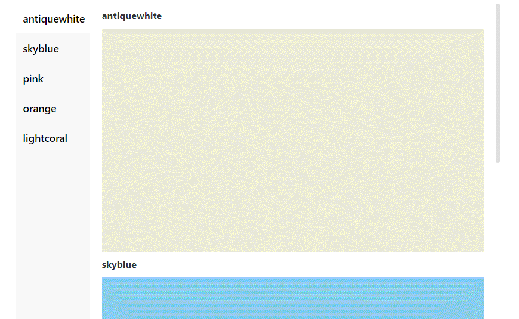

<h3 style="margin-bottom:0; font-size:38px; color:#b562b6; " align="center">anchor-scroll-menu 👋</h1>
<div style="font-size:25px; color:#666; " align="center">Anchor menu with scrolling contents for React</div>
<p align="center">
  <a href="https://www.npmjs.com/package/anchor-scroll-menu" target="_blank" rel="nooppener noreferrer"></a>
  <a href="https://www.npmjs.com/package/anchor-scroll-menu" target="_blank" rel="nooppener noreferrer"></a>
  <a href="https://github.com/Jay-Ohhh/anchor-scroll-menu/blob/master/LICENSE" target="_blank" rel="nooppener noreferrer"></a>
</p>

#### 🏠 [Homepage](https://github.com/Jay-Ohhh/anchor-scroll-menu)

#### ✨ [Demo & Document](https://jay-ohhh.github.io/anchor-scroll-menu)

## Install

```sh
$ npm install anchor-scroll-menu
```

## Snapshot



## Usage

```tsx
import React from 'react';
import { AnchorMenu } from 'anchor-scroll-menu';

const commonStyle = { height: 300 };
const id = +new Date();
const menuList = [
  {
    name: 'antiquewhite',
    key: `antiquewhite${id}`,
    content: <div style={{ ...commonStyle, backgroundColor: 'antiquewhite' }} />,
  },
  {
    name: 'skyblue',
    key: `skyblue${id}`,
    content: <div style={{ ...commonStyle, backgroundColor: 'skyblue' }} />,
  },
  {
    name: 'pink',
    key: `pink${id}`,
    content: <div style={{ ...commonStyle, backgroundColor: 'pink' }} />,
  },
  {
    name: 'orange',
    key: `orange${id}`,
    content: <div style={{ ...commonStyle, backgroundColor: 'orange' }} />,
  },
  {
    name: 'lightcoral',
    key: `lightcoral${id}`,
    content: <div style={{ ...commonStyle, backgroundColor: 'lightcoral' }} />,
  },
];

export default () => (
  <div style={{ width: '100%', height: 600 }}>
    <AnchorMenu menuList={menuList} />
  </div>
);
```

## API

| Name | Description | Type | Default |
| --- | --- | --- | --- |
| menuList | 菜单数据数组，key 请确保是唯一的，由字母数字组成，且必须以字母开头 | `{ name: string; content: ReactNode; key: string; }[]` | `[]` |
| menuStyle | menu 区域的 style | `CSSProperties` | `--` |
| placement | menu 区域的位置 | "top" \| "right" \| "bottom" \| "left" | `left` |
| scrollDirection | 滚动方向 | "vertical" \| "horizontal" | `vertical` |
| region | 手动滚动时，滚动内容跟父元素顶部距离的区间, 滚动内容一到达该区间, 对应菜单按钮高亮。如果滚动过快时，菜单没有高亮，不妨将区间增大。 | `[number, number]` | `[-20, 20]` |
| easing | 缓动动画函数 | "linear" \| "easeInQuad" \| "easeOutQuad" \| "easeInOutQuad" \| "easeInCubic" \| "easeOutCubic" \| "easeInOutCubic" | `easeInOutCubic` |
| duration | 用多少 ms 完成滚动动画，单位 ms | `number` | `300` |
| hideTitle | 隐藏内容块的 title | `boolean` | `false` |
| activeKey | 当前激活的 menu 的 key | `string` | `--` |
| onMenuClick | 点击菜单的回调函数 | `(key: string, index: number, activeKey: string) => void` | `--` |
| onReach | 点击菜单滚动到达目的地后的回调函数 | `(key: string, index: number) => void` | `--` |

## 👔 Author

**Jay-Ohhh**

- Website: https://github.com/Jay-Ohhh
- Github: [@Jay-Ohhh](https://github.com/Jay-Ohhh)

## 🤝 Contributing

Contributions, issues and feature requests are welcome!

Feel free to check [issues page](https://github.com/Jay-Ohhh/anchor-scroll-menu/issues). You can also take a look at the [contributing guide](https://github.com/Jay-Ohhh/anchor-scroll-menu/blob/master/CONTRIBUTING.md).

## Show your support

Give a ⭐️ if this project helped you!

## 📝 License

Copyright © 2022 [Jay-Ohhh](https://github.com/Jay-Ohhh).

This project is [MIT](https://github.com/Jay-Ohhh/anchor-scroll-menu/blob/master/LICENSE) licensed.

---

_This README was generated with ❤️ by [readme-md-generator](https://github.com/kefranabg/readme-md-generator)_
